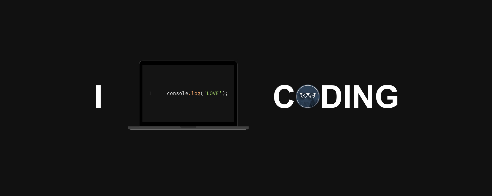

# 👋 Hello, I'm DevZarghami!

#### 💻 Full-Stack Developer | 🌐 Blockchain Enthusiast | 🚀 Innovator

#### About Me

👋 Welcome to my GitHub profile! With over 7 years of experience in both front-end and back-end development, I specialize in creating robust and scalable web applications. My journey has also led me into the exciting world of blockchain and cryptocurrency, where I've contributed to cutting-edge projects and exchanges.

---

#### 🛠️ Tech Stack

**Front-end:**
- 🌟 **Frameworks:** Vue.js, Nuxt.js, Svelte.js
- 🎨 **Styling:** Tailwind CSS, CSS-in-JS
- ⚙️ **State Management:** Vuex, RxJS

**Back-end:**
- 🚀 **Node.js Frameworks:** Express.js, NestJS, AdonisJS
- 🔗 **Blockchain:** Solidity, Web3.js, Ethers.js
- 🗃️ **Databases:** MySQL, PostgreSQL, MongoDB

**DevOps:**
- 🐳 **Containerization:** Docker, Kubernetes
- 🔄 **CI/CD:** GitHub Actions, Jenkins
- ☁️ **Cloud:** AWS, Azure, Google Cloud

---

#### 🚀 Projects

**[Project 1](#)**: Brief description of your amazing project.  
**[Project 2](#)**: Brief description of another project you're proud of.  
**[Project 3](#)**: Brief description of a project showcasing your blockchain expertise.

---

#### 🌐 Connect with Me

- [LinkedIn](https://www.linkedin.com/in/) 🌐
- [NPM](https://www.npmjs.com/~dev.zarghami) 📦
- [Dev.to](https://dev.to/dev_zarghami) 📝

---

#### 🏆 Achievements

- **Open Source Contributor**: Contributed to several high-profile projects.
- **Certified Developer**: AWS Certified Solutions Architect, Certified Kubernetes Administrator (CKA).
- **Speaker and Mentor**: Regular speaker at tech conferences and mentor to junior developers.

---

#### 🌱 Currently Learning

- **Advanced Blockchain Development**: Exploring Layer 2 solutions and DeFi protocols.
- **Machine Learning**: Integrating ML models into web applications.

---

#### 📫 How to Reach Me

Feel free to reach out to me via [dev.zarghami@gmail.com](mailto:dev.zarghami@gmail.com) for collaboration, mentorship, or just a friendly chat about tech and blockchain!

---

#### 📊 GitHub Stats

---

### ✨ Let's Build Something Amazing Together!
